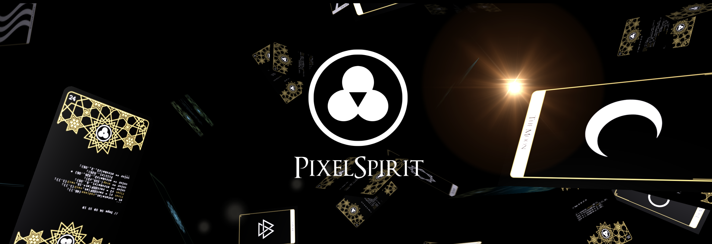
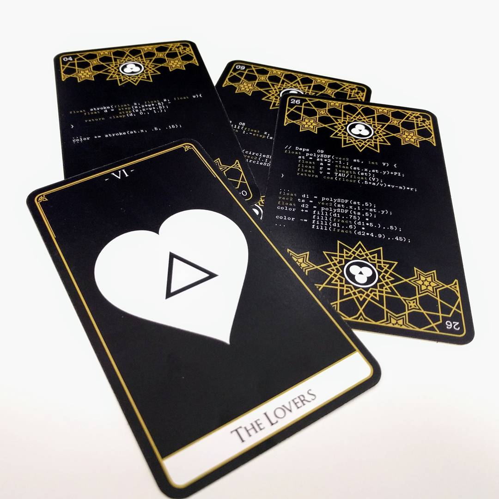
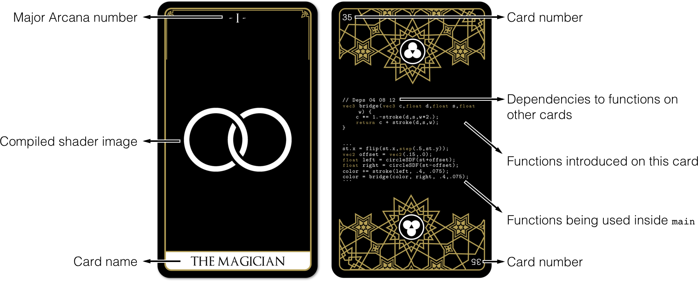
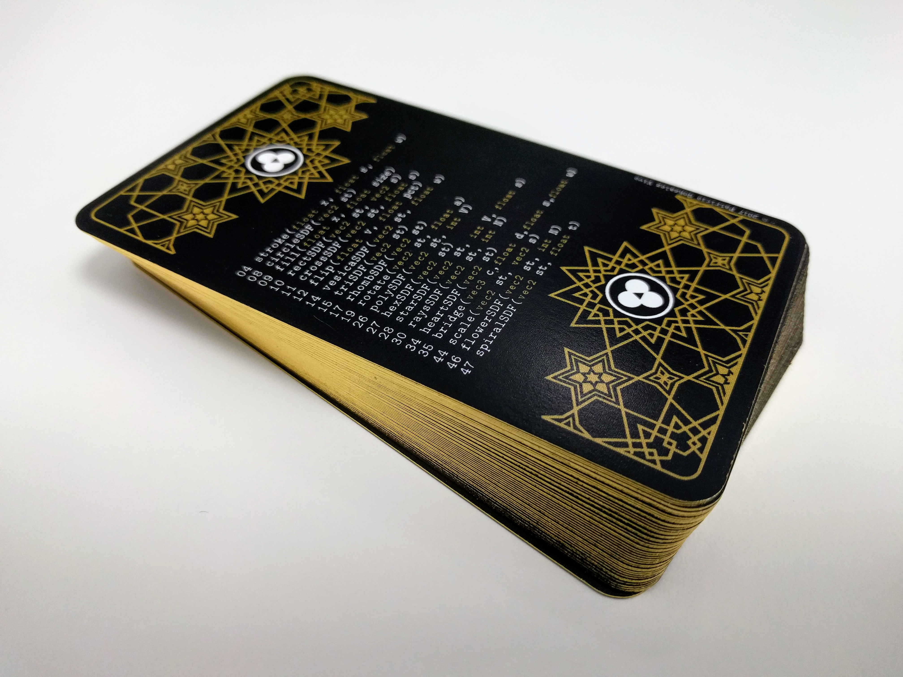

# [PixelSpirit Deck](https://pixelspiritdeck.com/)
by [Patricio Gonzalez Vivo](http://patriciogonzalezvivo.com/)

Each Pixel Spirit card presents a visual element together with the GLSL shader code that generates it. Ultimately, these elements can be reused and combined to compose an infinite visual language. This deck is a tool for learning, a library, and an oracle.



The cards are ordered as an unfolding continuum that goes from simplicity to complexity, from darkness to light, so they can be learned and memorized easily. Through this progression, the cards present new functions, creating a library of functions that can be reused and combined like a portable book of spells. Within the 50 cards of this deck you will find the 22 major arcana, the ancestral archetypes of the traditional Tarot deck: the wisdom of these powerful cards will guide you.




## Get and use the deck every day

[Visit PixelSpiritDeck.com there you can buy the deck and learn how to use them](https://pixelspiritdeck.com/)

If you are thinking on going through the cards to teach yourself shaders consider using [the following online editor: editor.pixelspiritdeck.com/](http://editor.pixelspiritdeck.com/)



## Compile the cards

1. Install [glslViewer](http://patriciogonzalezvivo.com/2015/glslViewer/) following the [instructions from here](https://github.com/patriciogonzalezvivo/glslViewer#install)

2. Compile any of the cards by:

```bash
    glslViewer 00-elements/000-void.frag
    glslViewer 00-elements/001-justice.frag
    glslViewer 00-elements/002-strength.frag
    glslViewer 00-elements/004-the_wall.frag
    ...
    glslViewer 00-elements/045-inner_truth.frag 
    glslViewer 00-elements/046-the_world.frag
    glslViewer 00-elements/047-the_fool.frag
    glslViewer 00-elements/048-enlightenment.frag
```

If you want to make PNG images of them you can do something like:

```
    glslViewer 00-elements/045-inner_truth.frag -s 1 -w 448 -h 748 -o innerthruth.png
```

You can also compile them and watch the one by one for 5 seconds like this:

```
    find . -name '*.frag' -exec glslViewer -s 5 -w 448 -h 748 {} \;  
```

## License 

Patricio Gonzalez Vivo hold all copyrights (c) 2017, on all the cards codes. You cannot host, display, distribute or share this Work in any form, including physical and digital. You cannot use this Work in any commercial or non-commercial product, website or project. You cannot sell this Work and you cannot mint an NFTs of it.

That said the functions under the folder `lib/` are now part of the [LYGIA shader library](https://lygia.xyz) under the double license: [Propserity License](https://github.com/patriciogonzalezvivo/lygia/blob/main/LICENSE.md) and [the Patron License](https://lygia.xyz/license) for sponsors and contributors. Also and more importantly I would love to see what you do with it! Share what you make to @pixelspiritdeck!


## Author

[Patricio Gonzalez Vivo](http://https://twitter.com/patriciogv): (1982, Buenos Aires, Argentina) is an artist and developer. He explores interstitial spaces between organic and synthetic, analog and digital, individual and collective. In his work he uses code as an expressive language with the intention of developing a better together.

[github](https://github.com/patriciogonzalezvivo) | [twitter](https://twitter.com/patriciogv) | [website](http://patricio.io)


## Acknowledges

These cards, as well as [The Book of Shaders](http://thebookofshaders.com), wouldn't be possible without the help of [Jennifer Lowe](http://jenlowe.net) my life partner, love of my life and constant collaborator.

Thanks to: [Lynn Cherny](https://twitter.com/arnicas), [Manolo Gamboa Naon](https://twitter.com/manoloidee), [Salome Asega](https://twitter.com/suhlomay), [Jaume Sanches Elias](https://twitter.com/thespite), [Geraldine Sarmiento](https::/twitter.com/sensescape), [Kevin Kripper](https://www.facebook.com/kevin.kripper), [Rachel Binx](https://twitter.com/rachelbinx) for their friendship and key feedback on this project.

Thanks to the people involved with the[Three.js](https://threejs.org/) library for making the construction of this WebGL page a pleasure. (Special thanks for that incredible lens flair.)

Also thanks to [DailyMinimal.com](http://www.dailyminimal.com/) and [Maria Linares Freire](https://twitter.com/LinaresFreire) for their constant stream of inspiration.
