Each Pixel Spirit card presents a visual element together with the GLSL shader code that generates it. Ultimately, these elements can be reused and combined to compose an infinite visual language. This deck is a [**tool for learning**](#cards-as-teacher), a [**library**](#cards-as-library), and an [**oracle**](#cards-as-oracle).

The cards are ordered as an unfolding continuum that goes from simplicity to complexity, from darkness to light, so they can be learned and memorized easily. Through this progression, the cards present new functions, creating a library of functions that can be reused and combined like a portable book of spells. Within the 50 cards of this deck you will find the 22 major arcana, the ancestral archetypes of the traditional Tarot deck: the wisdom of these powerful cards will guide you.

### Shop

Get your PixelSpirit deck 3rd Edition! PREORDER NOW! All decks will be shipped during MAY 2019.

    

    

        <!-- Begin MailChimp Signup Form -->
        <link href="//cdn-images.mailchimp.com/embedcode/horizontal-slim-10_7.css" rel="stylesheet" type="text/css">
        

        

            <form action="//pixelspiritdeck.us15.list-manage.com/subscribe/post?u=a45f450f6faf0e689e8bafdf6&amp;id=4969949bd2" method="post" id="mc-embedded-subscribe-form" name="mc-embedded-subscribe-form" class="validate" target="_blank" novalidate>
                

                    <label for="mce-EMAIL">Subscribe to our mailing list to recieve notifications. </label>
                    <input type="email" value="" name="EMAIL" class="email" id="mce-EMAIL" placeholder="email address" required>
                    <!-- real people should not fill this in and expect good things - do not remove this or risk form bot signups-->
                    
<input type="text" name="b_a45f450f6faf0e689e8bafdf6_4969949bd2" tabindex="-1" value="">

                    
<input type="submit" value="Subscribe" name="subscribe" id="mc-embedded-subscribe" class="button">

                

            </form>
        

         
    

    

## Guidance

### Cards as Teacher

The cards are presented as an unfolding progression. The order is indicated by a two digit arabic number on the back of the cards. The variations become more complex at higher values.

**How to use the deck for learning?** Start by sorting the cards according to the numbers on their fronts, so that the card `00` (The Void), is on the top of the pile facing down, exposing the back of the cards. Read the code on the back and think about it. Analyze its meaning; imagine how the front will look. Then turn it over and contemplate the result. Repeat this all through the card deck. If you feel lost (which is ok), use the online editor to recode it. Do this with presence and intention.

**Note**: at the beginning of the deck the entire GLSL code is provided, then only the new functions and how to use them.

    

        

            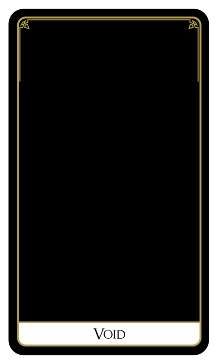
        

        

            
        

    

    

        

            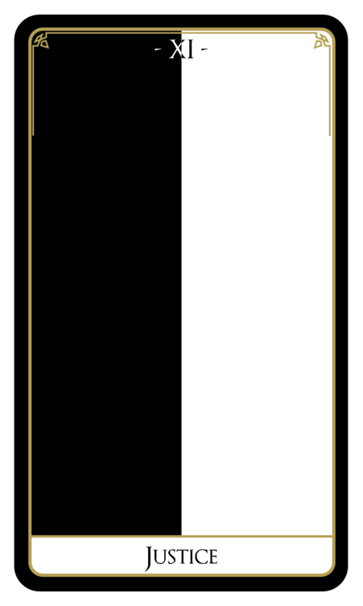
        

        

            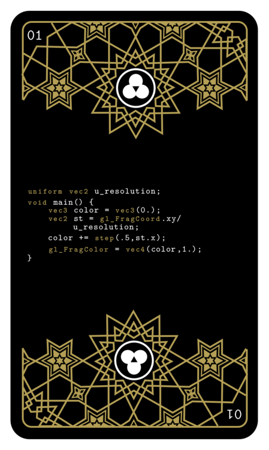
        

    

    

        

            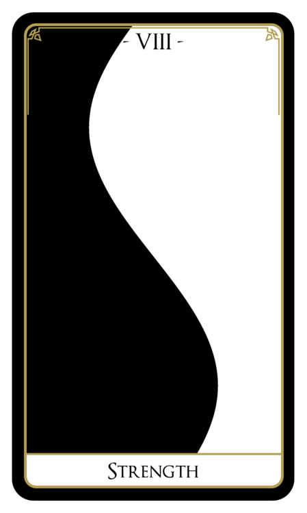
        

        

            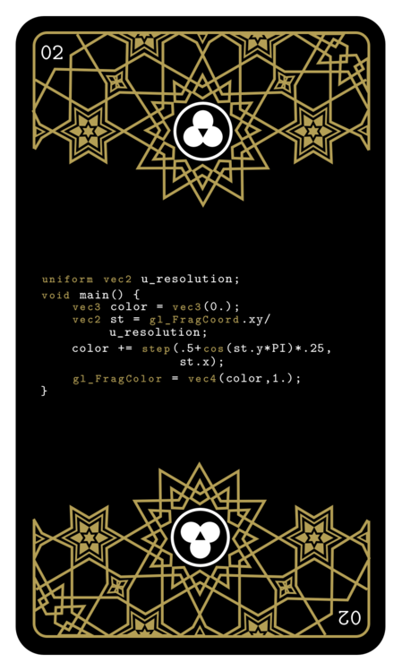
        

    

    

        

            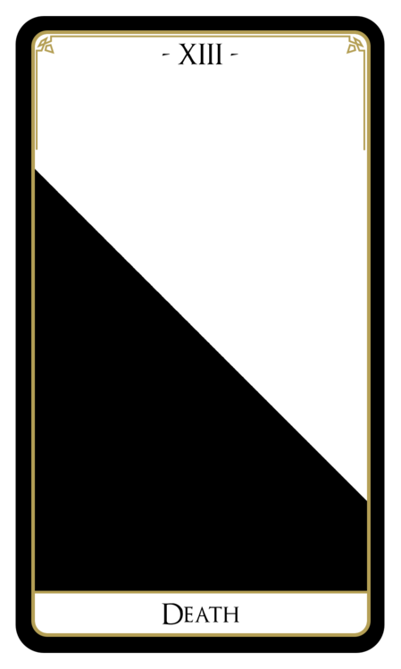
        

        

            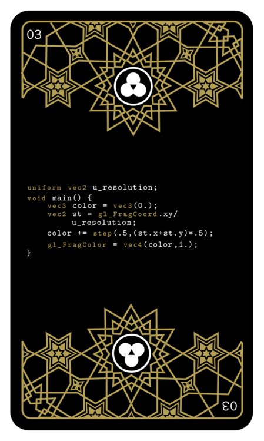
        

    

**Re-Code**: the perfect way to go through the cards teaching yourself shaders is through [this online editor: editor.pixelspiritdeck.com/](http://editor.pixelspiritdeck.com/).

### Cards as Library

New functions are presented along the progression of the cards. The functions are defined only once, then reused throughout the deck. In this way, this deck also is a physical library, a catalog of the variations that compose these programmatical archetypes.

**How to use the deck as a library?** Find a shape or visual pattern you want to know more about. Turn the card over to see if a new function is introduced, or if there are *dependencies* to functions on other cards. They will appear as numbers under the comment line that starts with `// Deps .. .. ..`.

Search for the cards with those numbers, on the back of those cards you will find the needed functions.

    

        

            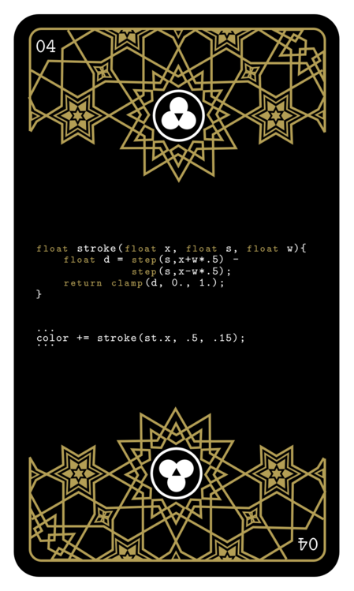
        

        

            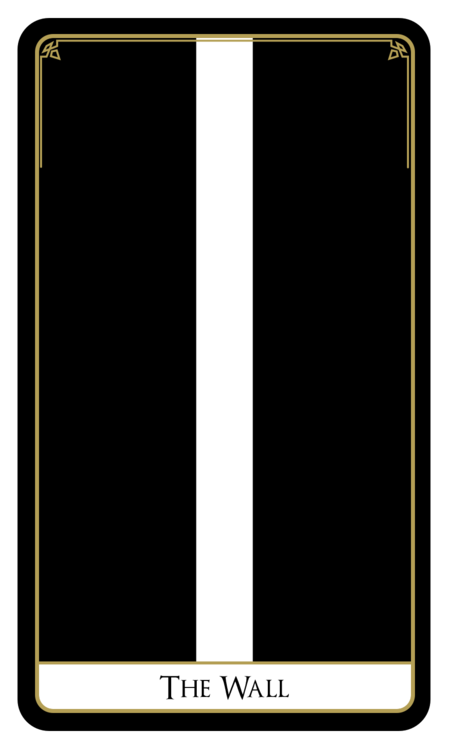
        

    

    

        

            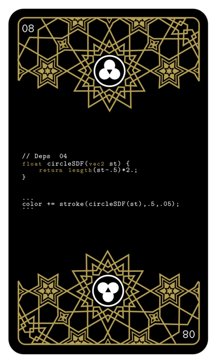
        

        

            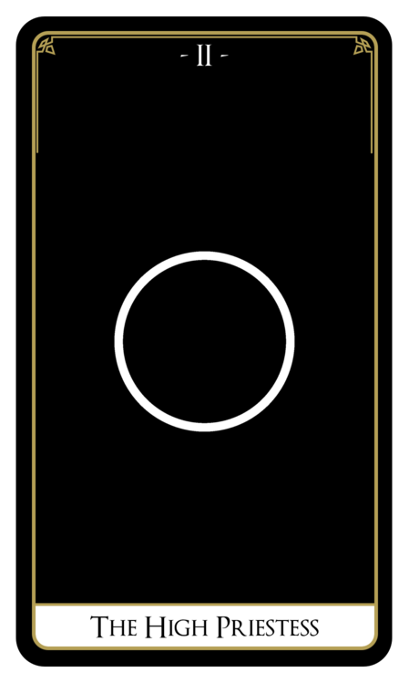
        

    

    

        

            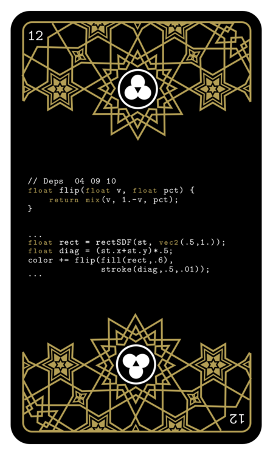
        

        

            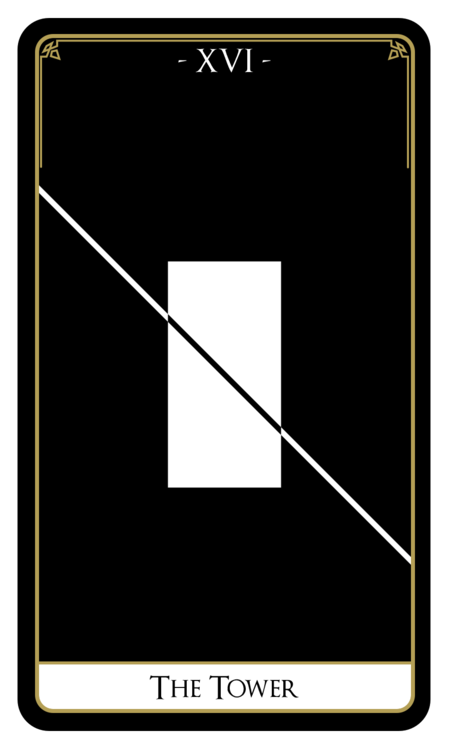
        

    

**Download**: the [code for the functions in the library here](https://github.com/patriciogonzalezvivo/PixelSpiritDeck/tree/master/lib) under [this license](https://github.com/patriciogonzalezvivo/PixelSpiritDeck/blob/master/LICENSE)

### Cards as Oracle 

The evolving images and their symbolic meaning resonate with the card's name. Each card refers to an archetype: a luminous symbolic structure that could resonate with you subconsciously.

**How to use the deck as an oracle?** Find a quiet space and take your time to define an intention in your mind. Try to describe it as a sentence, or a question. Check with yourself and adjust the words until they make sense to you and feel right. Once you are clear and focused, choose a random card with your left hand. Put the front up, so you can see it clearly and meditate on the meaning. You may have more questions about it, or simply have the feeling that there is something else, if that's the case take another card.

**Note**: For those with experience in Tarot readings, you'll be happy to find the 22 Major Arcana.

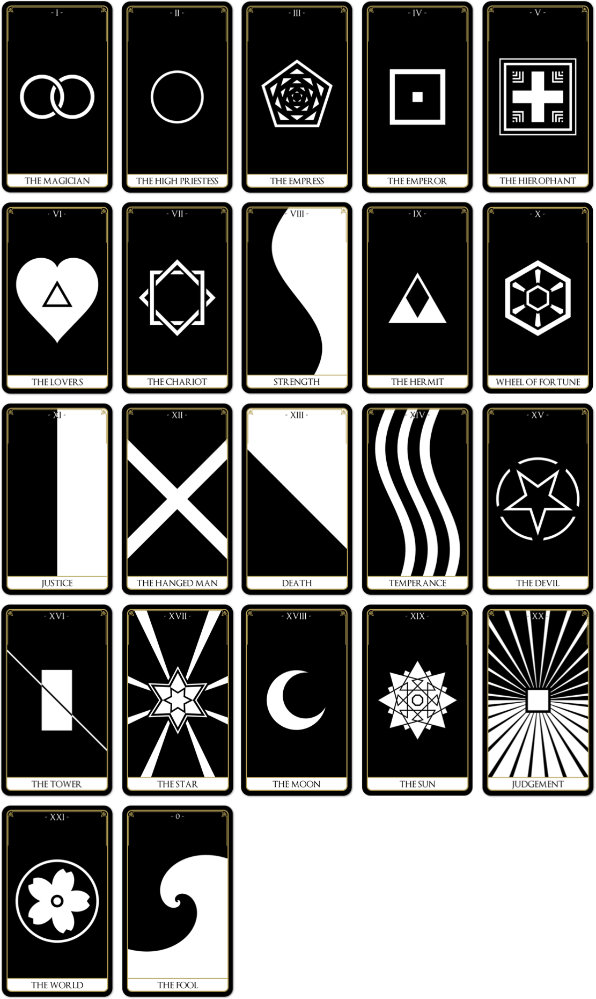

## Gallery

## Author

[**Patricio Gonzalez Vivo**](http://patriciogonzalezvivo.com) (1982, Buenos Aires, Argentina) is an artist and developer. He explores interstitial spaces between organic and synthetic, analog and digital, individual and collective. In his work he uses code as an expressive language with the intention of developing a better together.

## Acknowledges

These cards, as well as [The Book of Shaders](http://thebookofshaders.com), wouldn't be possible without the help of [Jennifer Lowe](http://jenlowe.net) my life partner, love of my life and constant collaborator.

Thanks to: [Lynn Cherny](https://twitter.com/arnicas), [Manolo Gamboa Naon](https://twitter.com/manoloidee), [Salome Asega](https://twitter.com/suhlomay), [Jaume Sanches Elias](https://twitter.com/thespite), [Geraldine Sarmiento](https::/twitter.com/sensescape), [Kevin Kripper](https://www.facebook.com/kevin.kripper), [Rachel Binx](https://twitter.com/rachelbinx) for their friendship and key feedback on this project.

Thanks to the people involved with the[Three.js](https://threejs.org/) library for making the construction of this WebGL page a pleasure. (Special thanks for that incredible lens flair.)

Also thanks to [DailyMinimal.com](http://www.dailyminimal.com/) and [Maria Linares Freire](https://twitter.com/LinaresFreire) for their constant stream of inspiration.

## Projects that use PixelSpirit Deck

**PixelSpirit Table** by [Colin Evoy Sebestyen](http://www.movecraft.com/)

<iframe src="https://player.vimeo.com/video/231285044?title=0&byline=0&portrait=0" width="575" height="323" frameborder="0" webkitAllowFullScreen mozallowfullscreen allowFullScreen></iframe>

    <!-- Begin MailChimp Signup Form -->
    <link href="//cdn-images.mailchimp.com/embedcode/horizontal-slim-10_7.css" rel="stylesheet" type="text/css">
    
    

    <form action="//pixelspiritdeck.us15.list-manage.com/subscribe/post?u=a45f450f6faf0e689e8bafdf6&amp;id=4969949bd2" method="post" id="mc-embedded-subscribe-form" name="mc-embedded-subscribe-form" class="validate" target="_blank" novalidate>
        

        <label for="mce-EMAIL">Subscribe to our mailing list</label>
        <input type="email" value="" name="EMAIL" class="email" id="mce-EMAIL" placeholder="email address" required>
        <!-- real people should not fill this in and expect good things - do not remove this or risk form bot signups-->
        
<input type="text" name="b_a45f450f6faf0e689e8bafdf6_4969949bd2" tabindex="-1" value="">

        
<input type="submit" value="Subscribe" name="subscribe" id="mc-embedded-subscribe" class="button">

        

    </form>
    

    <!--End mc_embed_signup-->

